# PMSM的 Sensorless FOC

- 基于观测器估计转子位置、转速，设计无感FOC的电流、速度双闭环的调速系统。
- 通过Simulink对Sensorless FOC建模，仿真，代码生成。
- 基于Simulink搭建上位机，观察电流ia/ib, Id/iq, 位置theta，速度speed。
- 在STM32G4 嵌入式平台上调试，测试。

## 一.  PMSM/BLDC的无感FOC原理

###  1.1 磁链观测器

​     磁链观测器（Magnetic [Flux](https://so.csdn.net/so/search?q=Flux&spm=1001.2101.3001.7020) Observer）是一种在电机控制系统中常用的技术方法，尤其在VESC（Vedder电子速度控制器）中得到了广泛的应用。它的作用是实时观测电机内部的磁链，并将其转化为电压信号。alph-beta轴的磁链\psi_\alpha、\psi__\beta，的方程为：
$$
\psi_{\alpha} =\int{(V_{\alpha}-I_{\alpha}R)dt}-(L_s.I_{\alpha})\\
\psi_{\beta}= \int{(V_{\beta}-I_{\beta}R)dt}-(L_s.I_{\beta})
$$
设定
$$
V_{\alpha}-I_{\alpha}R = v_1(t)\\
V_{\beta}-I_{\beta}R = v_2(t)
$$
alph-beta轴的磁链\psi_\alpha、\psi__\beta的积分项的Laplace表示为：
$$
L(\int{v_1(t)}dt)=\frac{1}{s}L(v_1(t)) = \frac{1}{s}v_1(s)\\
L(\int{v_2(t)}dt)=\frac{1}{s}L(v_2(t)) = \frac{1}{s}v_2(s)
$$
这里引入截止频率为omega_c的LPF来对积分项处理，这样能消除DC offset
$$
L(\int{v_1(t)}dt)=\frac{1}{s+\omega_c}v_1(s)\\
L(\int{v_2(t)}dt) = \frac{1}{s+\omega_c}v_2(s)
$$
如前所述，基于 LPF 的积分器使该模块能够消除 Ψα 和 Ψβ 中可用的任何直流分量。
$$
\psi_{\alpha} = \frac{L_r}{L_m}(\int{(V_{\alpha}-I_{\alpha}R)dt}-\sigma L_s.I_{\alpha})\\
\psi_{\beta} = \frac{L_r}{L_m}(\int{(V_{\beta}-I_{\beta}R)dt}-\sigma L_s.I_{\beta})
$$
转子位置估算、转矩、磁通为：
$$
\sigma=1 - \frac{L_m^2}{L_r.L_s}\\
\theta_e = tan^{-1}\frac{\psi_\beta}{\psi_\alpha}\\
T_e = \frac{3}{2}.P.\frac{L_m}{L_r}(\psi_{\alpha}I_{\beta}-\psi_{\beta}I_{\alpha})\\
\psi = \sqrt{\psi_{\alpha}^2+\psi_{\beta}^2}
$$

### 1.2 开环转闭环的切换策略

​    I/F控制，开环拖动电机运行稳态后，拖动电角度theta_e_re与电机电角度theta_e之间纯在相位差，theta_L。 在切换到采用磁链观测器的无位置传感器闭环算法时，容易引起电流冲击和转速波动，甚至导致切换失败。

论文“A Simple Startup Strategy Based on Current Regulation for Back-EMF-Based Sensorless Control of PMSM”提到了一种简单的IF切换闭环的策略，通过拖动电角度和观测器估计电角度之间的平滑过渡，而角度是角速度的积分，进一步转矩Te决定了角速度w的增减。
$$
T_e = \frac{3}{2}n_p i_q^*cos{\theta_L}(\psi_{m}+(L_d-L_q)i_q^* sin{\theta_L})\approx K_T i_q^*cos{\theta_L}
$$
转矩方程
$$
T_e - T_L = J\frac{\Omega_r}{dt}= \frac{J}{n_p}\frac{\omega_r}{dt}
$$
功率角theta_L
$$
\frac{d\theta_L}{dt} = \omega_r - \omega_e
$$
在I/F开环拖动电机转速稳定后，通过线性衰减iq\* ,让电机的拖动电角度theta_re趋近于观测器电角度theta_hat，iq\* 衰减公式为：
$$
i_q^* = i_{q0}^* - K_i(t - t_0)
$$
​       I/F过渡的电机转速，电角度相位差，转矩电流iq\* 的变化过程如下图所示，在2.5s左右，iq\* 开始衰减，电角度相位差衰减逐渐衰减到接近0，在此过程中，电机转速保持恒定。

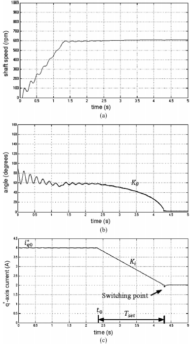

当相位差小于阈值(>0), 即可停止iq\*衰减。

## 二.  PMSM/BLDC的无感FOC建模

​          通过simulink 对控制系统进行建模，分为全局变量、低频任务500Hz（计算速度环PI， 按键读取，给定速度信号处理）, 高频任务10kHz（电流环），ADC采样完成触发、仿真模型、串口读取指令。

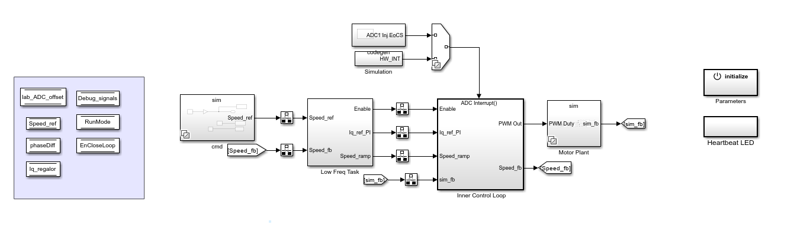

​         这里将电机的控制状态分为4个阶段，第0阶段，Enable=0,电机停止转动；第1阶段，设置theta=0, Iq\* =初始值，电机对齐；第2阶段，电机处于|/F开环拖动，先线性增加拖动角速度，达到设定值后电机保持匀速转动，然后线性衰减Iq\* ,使得拖动电角度和观测器电角度的相位差小于设定阈值时，转矩电流iq\* 停止衰减，切换到下一阶段；第3阶段，通过观测器估计的电角度和速度进行闭环FOC控制，通过EnCloseLoop状态变量，来判断电机是否处于闭环状态。

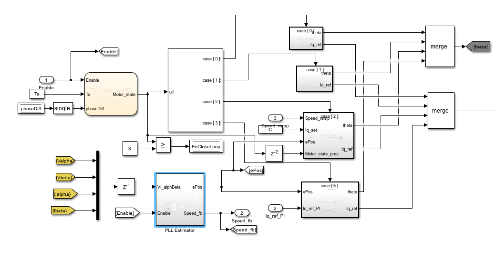

​       第2阶段，主要通过几个积分器来实现斜坡函数，当电机的钻速达到预定的转速时，这里需要线性递减iq\*, 同时计算拖动电角度和观测器电角度的相位差，直到切换到下一阶段。

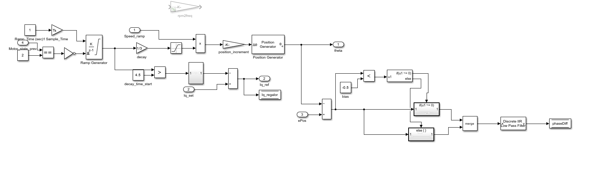

几种状态之间的切换关系如下图所示：

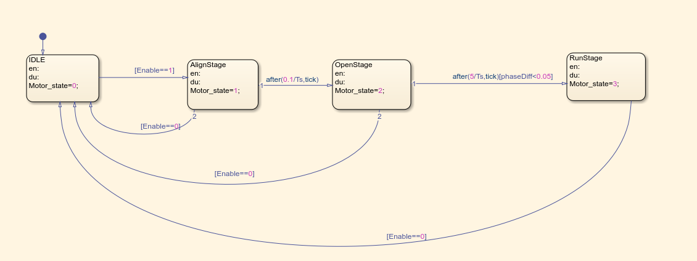

​      电流计算以及设置过流保护阈值

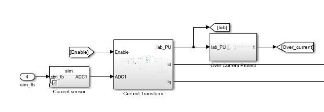

电流环PI计算，以及SVPWM调制， 信号监控，pwm信号输出等。

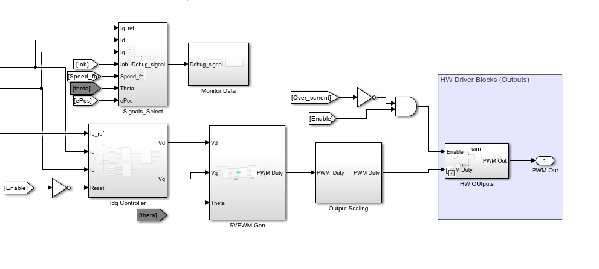

## 三  PMSM/BLDC的仿真

​                                                                                          仿真bldc模型

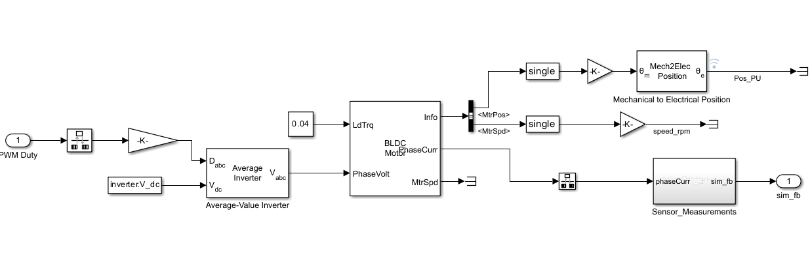

​       电机的启动过程分为几个阶段，第一，对齐；第二步，恒定Iq\* ,逐渐增加开环角速度，使得电机从0开始加速，然后维持角速度不变；第三步，切换过程，由于负载功角theta_L > 0，此时，观测器的电角度theta_e 与拖动电机的开环电角度位置存在相位差，线性衰减Iq\* ，直到相位差小于阈值（这里设定5°），切换到下一阶段；第四步，使用观测器计算的电角度和速度进行速度闭环控制，切换初始阶段，有轻微抖动，但又迅速稳定到了速度闭环状态。

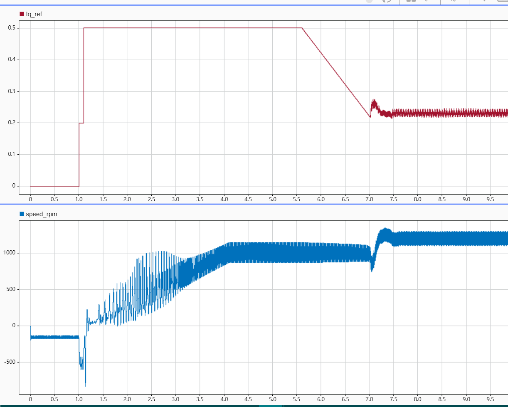

相位差变化，当Iq\* 衰减时，相位差平滑下降，直到切换到闭环。

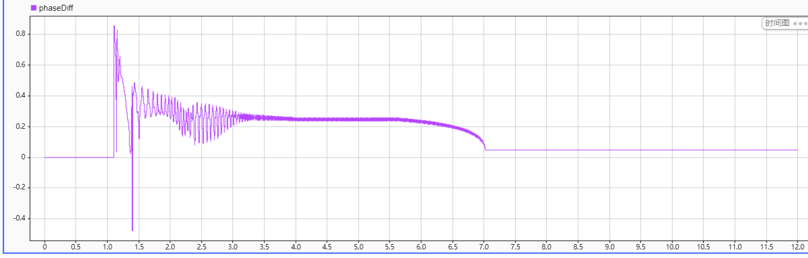

## 四  PMSM/BLDC的实验

### 4.1 硬件平台

​       主控MCU采用STM32G474RET6，三相逆变器使用IHM08M1，电源采样24V开关电源。

### 4.2 软件组成

配置文件：

​    为便于迁移模型到不同的电机和逆变器，这里设计了参数脚本进行设置，不同环境下的配置参数。

这里主要设置仿真/采样的时间步长，和速度，电流控制的频率。

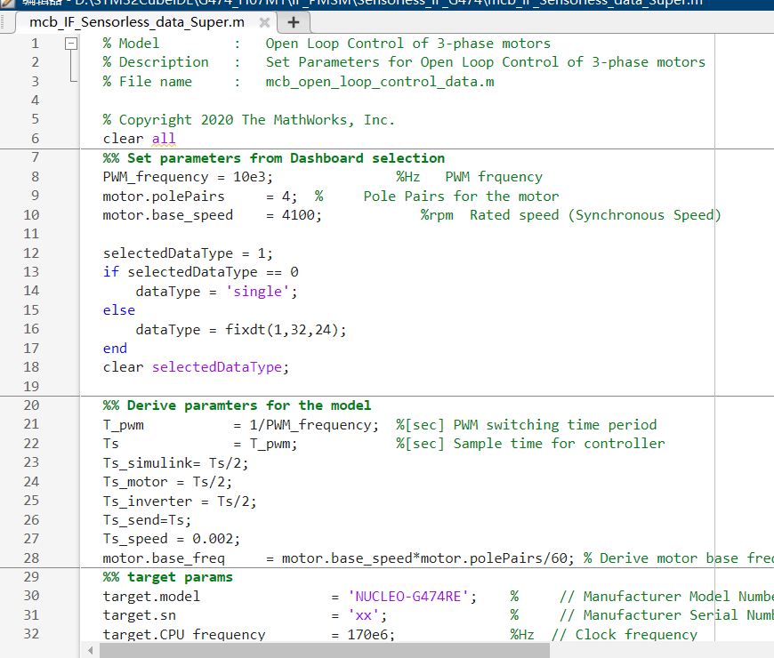

这部分设置逆变器的参数，采样电阻，电流增益，采样范围。

这部分设置电机的参数，和运行参数。

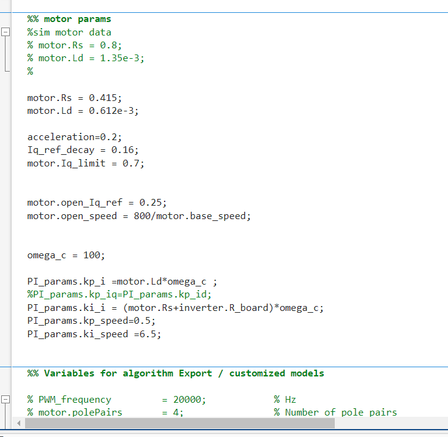

运算，这里采取标幺的方式与定点数进行结合，提高数据运算的速率。

上位机：

​      使用simulink搭建了一个上位机，便于调试相关参数与信号

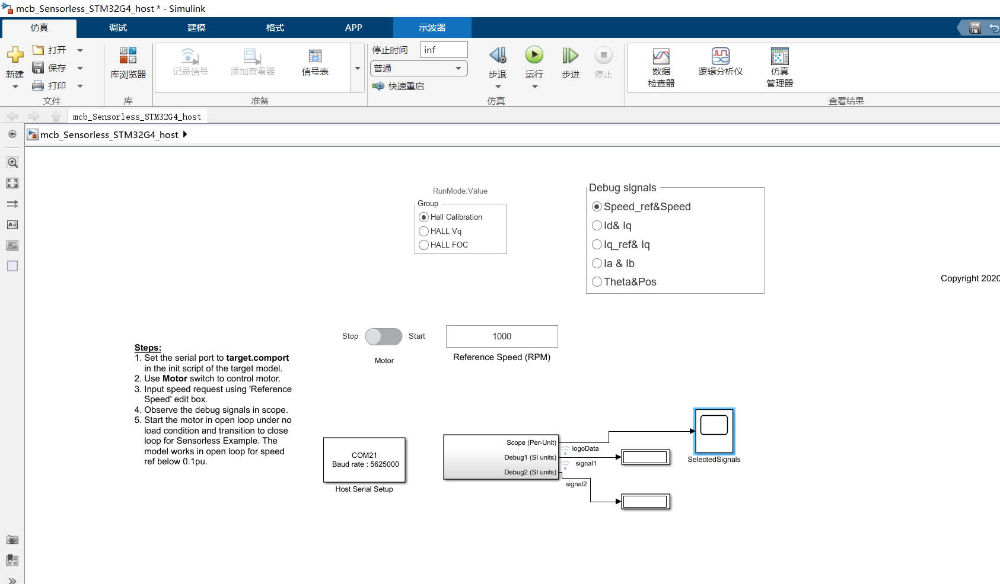

### 4.3 实验结果

​                                        拖动位置和观测器估计电角度, 蓝色为观测器观测电角度，黄色为开环控制电角度，在开环拖动下，两者存在相位差。

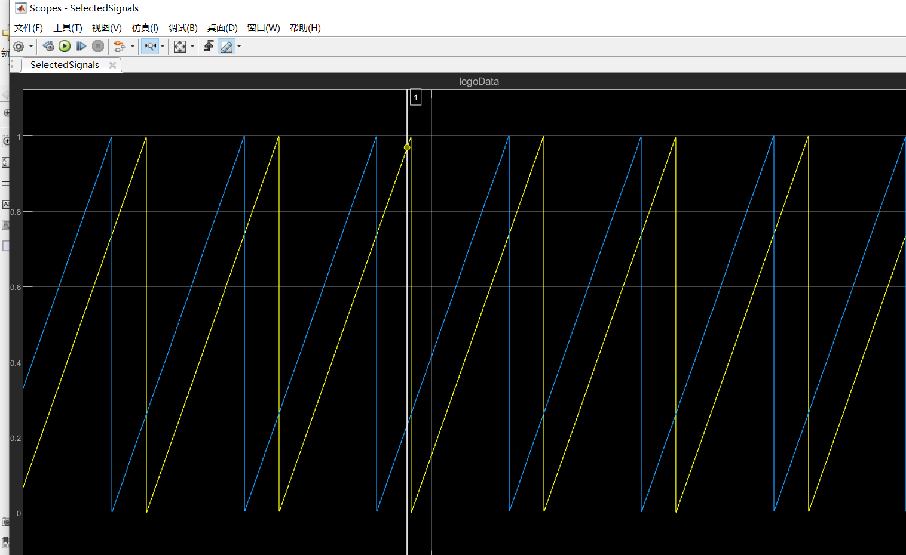

切换过程中，相位差减小。

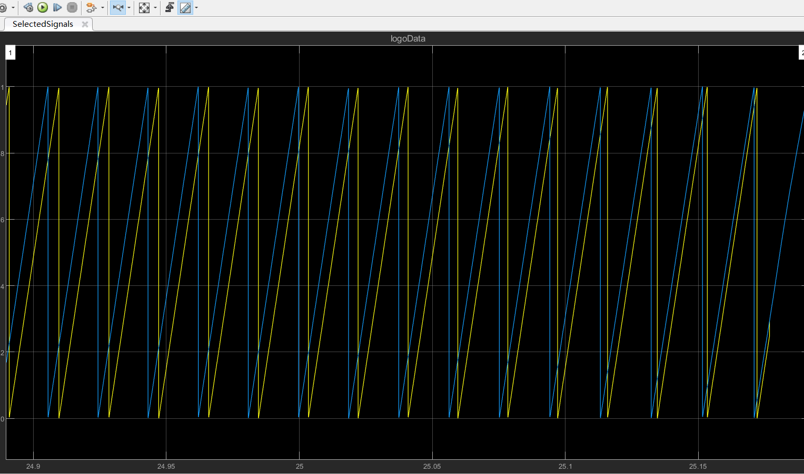

Iq\* 启动保持稳定，当电机转速稳定后，Iq\* 衰减，直到切换到闭环状态。

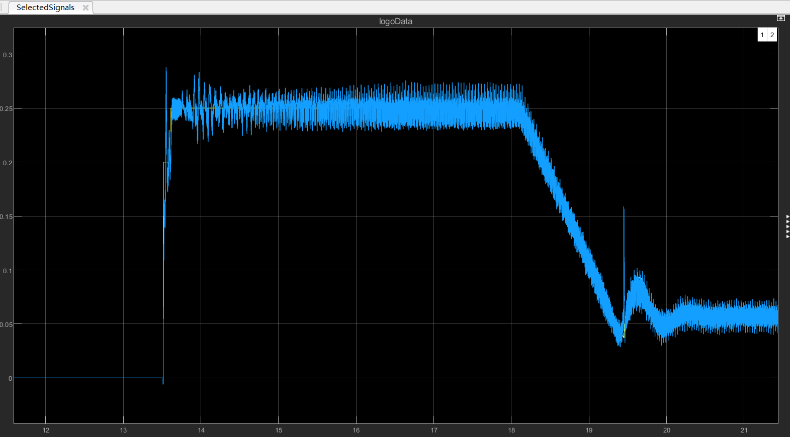

电机的速度响应如下图，当设定速度发送变化时，电机的速度迅速加/减速，直到短暂超调后，稳定到给定速度附件。当电机速度低于600rpm时，观测器观测电角度不准，此时闭环失败。

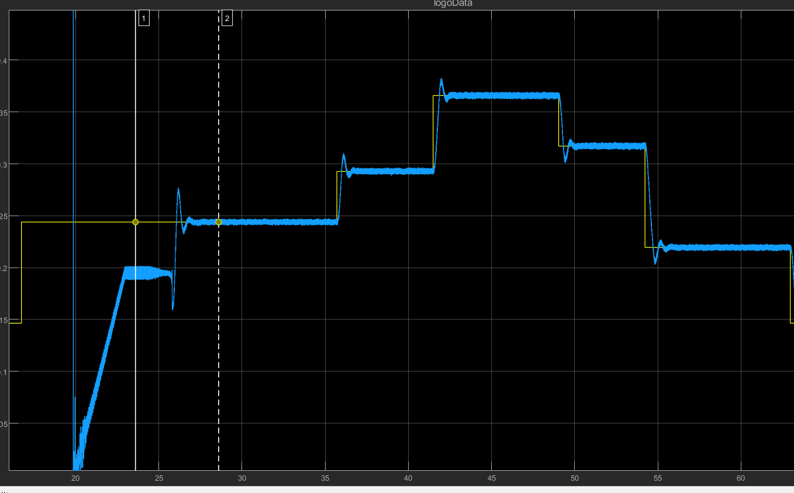