# Sensorless_FOC_Estimate_Parameters

## 一、PMSM参数辨识

参数辨识算法来确定永磁同步电机 (PMSM) 的参数：

- 相电阻，*Rs*（欧姆）

- `d` 轴电感，*Ld*（亨）

- `q` 轴电感，*Lq*（亨）

- 反电动势常量，*Ke*（Vpk_LL/krpm，其中 Vpk_LL 是线电压峰值）

- 电机惯量，*J* (Kg.m^2)

- 摩擦常量，*B* (N.m.s)

该算法接受最少的必需输入，并在目标硬件上运行测试以估计 PMSM 参数。

其中相电阻，电感为静态参数，在pmsm静止状态时，反向电动势为0，电压方程为：
$$
u_d = R_s i_d + L_d \frac{di_d}{dt}\\
u_q = R_s i_q + L_q \frac{di_q}{dt}
$$

其中电阻的辨识最简单，只需通过万用表欧姆档测量任意两端的电阻，将该值除以2，得到相电阻的值。

电感，可通过电桥法测量，任意两端的电感，进而得到相电感。

​                                                                   Y形接法的线电感

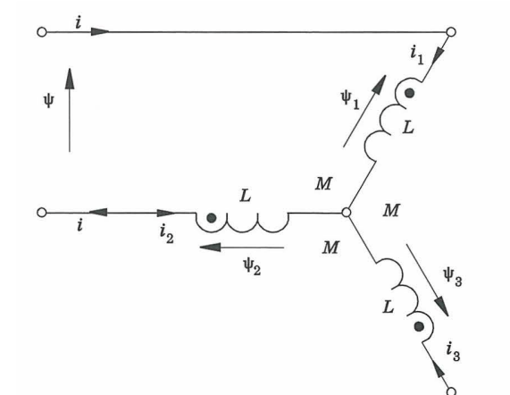

在实际电路中，需要考虑到自感以及互感的影响, 在转动电机的过程中，电感的数值会发生变化。根据交、直轴电感与电感最值关系，推测得到。

此外，还有采取如下图接法，直接接线测量，交、直轴电感，这种接法也称为“一串两并”接法，即将B、C两相绕组并联在一起，形成一个新的端点，用RLC测试仪或其他装置测量该端点和A相绕组端点之间的电感。通过缓慢转动转子，同样也可以测得一个电感的最大值Lₘₐₓ和一个最小值Lₘᵢₙ，Lₘₐₓ和Lₘᵢₙ与Ld和Lq的关系如下(推导过程略)：

​          对于内嵌式的永磁同步电机

Lₘₐₓ=(3/2)Lq

Lₘᵢₙ=(3/2)Ld 

​      对于电励磁的凸极同步电机

Lₘₐₓ=(3/2)Ld

Lₘᵢₙ=(3/2)Lq  

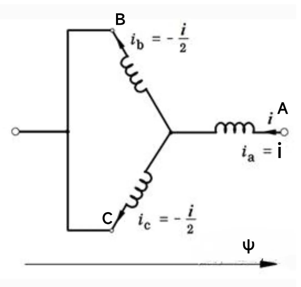

有了 Rs, Ld, Lq时，就能进行无感FOC控制

PMSM Mechanical Parameter Estimator 模块使用相电流和电压、电机两端的直流电压、电机位置和转速、定子电阻、*d* 轴电感及其他测试配置元素来估计 PMSM 的以下机械参数：

- 反电动势常量 *Ke*
- 转子惯量 (*J*)
- 粘性阻尼 (*B*)

pmsm转动时的电压方程为：
$$
u_d = R_s i_d + L_d \frac{d i_d}{dt} - n_p \omega L_q i_q \\
u_q = R_s i_q + L_q \frac{d i_q}{dt} + n_p \omega(L_d i_d +\psi_m)
$$
反向电动势系数：*Ke*=*np**ψ**m*.

设定pmsm维持额定转速*W*n    ,测量此时的电压，电流，根据已知的电阻，电感，推出反向电动势系数*Ke*

力矩方程：
$$
T_e = n_p[\psi_m i_q +(Ld-Lq)i_d i_q]=n_p\psi_m i_q\\
T_e - T_L = \frac{J}{n_p}.\frac{d\omega}{dt} +B \omega
$$
设定pmsm进入减速阶段，设定iq\* =0，则Te近似为0， 则需拟合求解方程中的J,B。

## 二、基于逆变器的PMSM参数辨识

### 2.1 静止电路参数

​        在pmsm foc的三相逆变器中，施加电压ud、uq 可通过调制设置，电流ia、ib 通过采样电阻adc计算得到，在此基础上，在pmsm静止状态时，通过ud施加直流电压，得到恒定的直流电流id， Ld (did/dt) = 0，电阻的计算公式为：
$$
R_s = \frac{u_d}{i_d}\\
$$
需要设置ud= 0.1*UN~ 0.5*UN, 确保id处于adc采样值的有效范围，且信噪比较好。

​        电感的测量，Ld 、Lq，在ud设置一定角频率w的交流信号，则id中包含交流信号：
$$
u_d = Asin(\omega t) + bias \\
交流分量：u_d = (R+j\omega L_d)id
$$
通过提取ud、id的交流分量，通过相位与幅值的差异，结算得到Ld，需要注意好交流信号的频率和幅值，当电感值较小时，w较大，当电感较大时，w较小，w取值范围一般为100~1000 Hz,

同理，可推测得到Lq；

为消除单次测量的误差，通常采样多种频率的交流信号，即，扫频获得的电感，平均得到。

### 2.2 转动机械参数

​      

- 反电动势常量 *Ke*
- 转子惯量 (*J*)
- 粘性阻尼 (*B*)

在pmsm处于无感FOC的速度闭环，设定电机转速为额定转速的0.9倍，根据电压方程，由于转速稳定下，did/dt=0, diq/dt=0，电压方程变为：
$$
u_d = R_s i_d - n_p \omega L_q i_q \\
u_q = R_s i_q + n_p \omega(L_d i_d +\psi_m)
$$
在pmsm处于稳态运行过程中，Ke也简单求得

​          对于pmsm的转动惯量*J*，设定pmsm的转速从0.9**额定转速*，减速到0.1**额定转速*，此过程中设定iq\* = 0 ，电磁转矩*T_e*约等于0，则减速时间T是一个重要测量指标，来计算转子惯量 (*J*)。

## 三、PMSM参数辨识建模与仿真

### 3.1 整体框架

​       模型整体沿用sensorless FOC框架，在inner control loop中加入参数辨识的计算和控制策略，

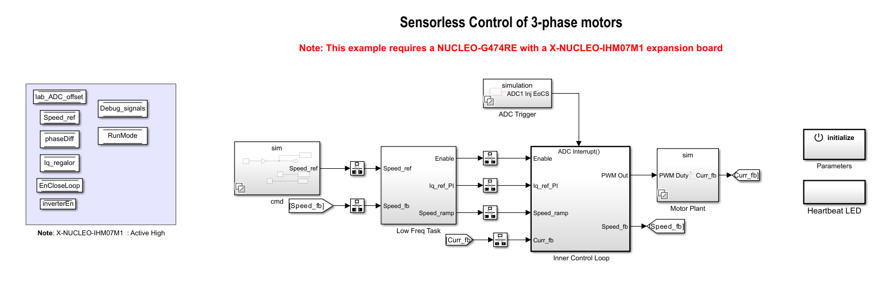

​     参数辨识的输入信号包括：id, iq, vd, vq, speed_fb，输出pmsm的Ke、J、B，以及逆变器使能信号。

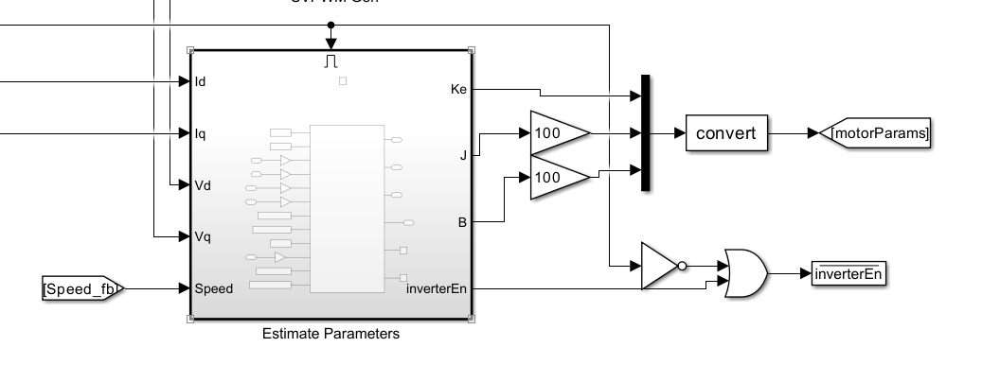

对于辨识pmsm的机械参数，需要给定电阻，电感参数数值。

### 3.2 仿真结果

​         bldc的相关参数如下：

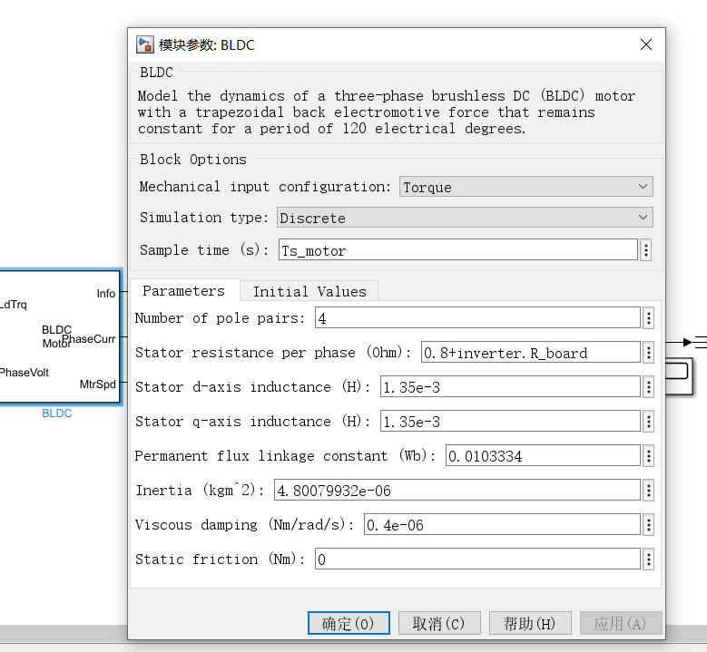

pmsm的参数辨识中：保持2000rpm，计算出Ke, 设置转矩为0，将2000rpm减速到200rpm, 根据减速时间计算转动惯量*J*      。

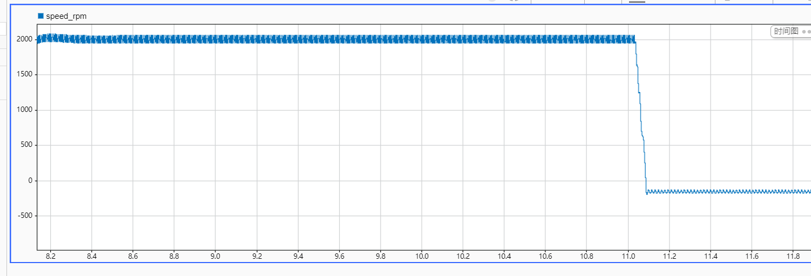

Ke在pmsm维持速度2000rpm 3s后，计算得到6.979，

motor.fluxPM   = (motor.Ke)/(sqrt(3)*2*pi*1000*motor.polePairs/60); %PM flux computed from Ke;

motor.fluxPM   =  0.0096 wb;   误差7%。

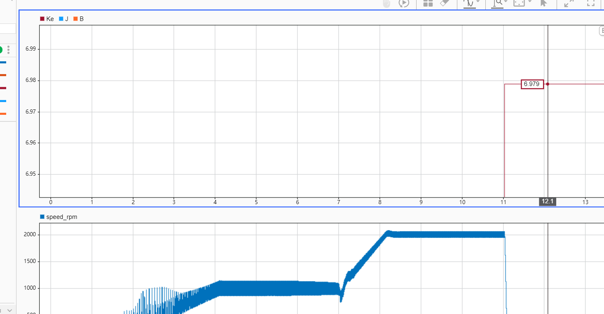

J 和B有较大误差，J估计值为2e-4, 实际值为4.8e-6, 这是由于Iq的没有迅速衰减到0以及震荡导致

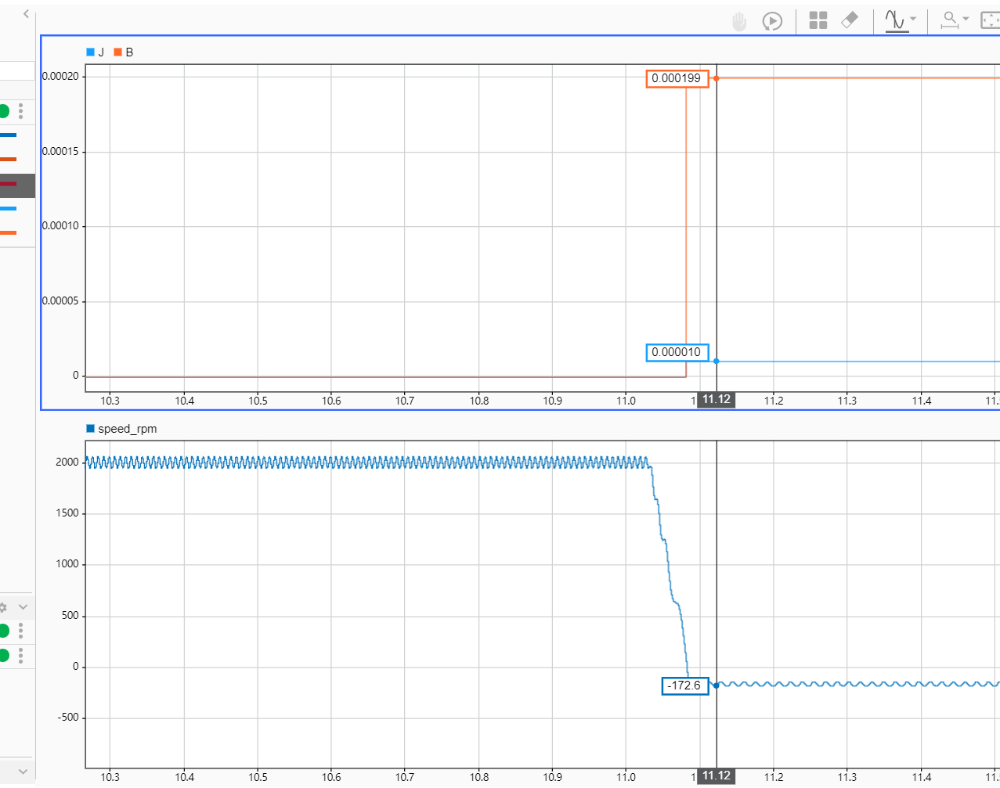

Iq变化曲线，看出Iq的震荡明显，在减速阶段Te不为0，从而导致计算误差较大。

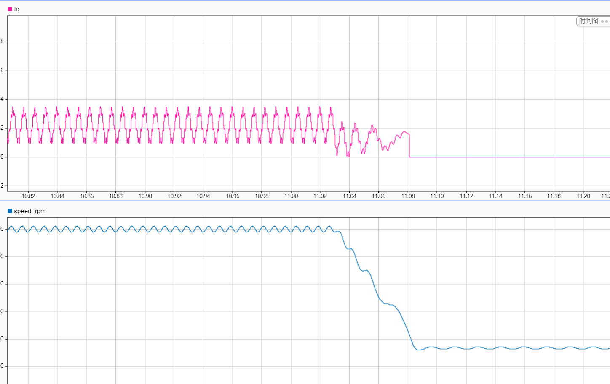

## 四，实验结果：

速度响应曲线（黄色）：在计算Ke过程中，电机转速维持在最大转速 3s,后电机的钻速下降，此下降过程用于估计电机的转动惯量J和摩擦系数B。

Ke = 5.473;

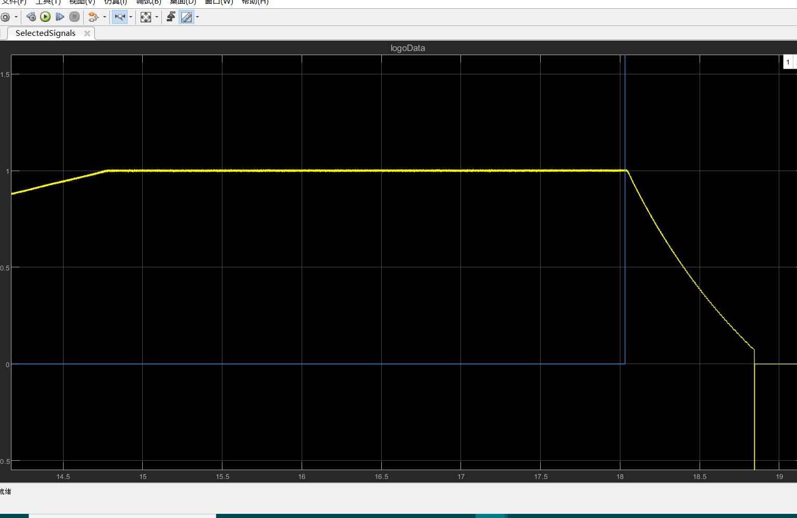

速度下降大约持续0.85s，估计出电机的J=2.79e-5 ,  B = 3.366e-5;

此后逆变器关闭

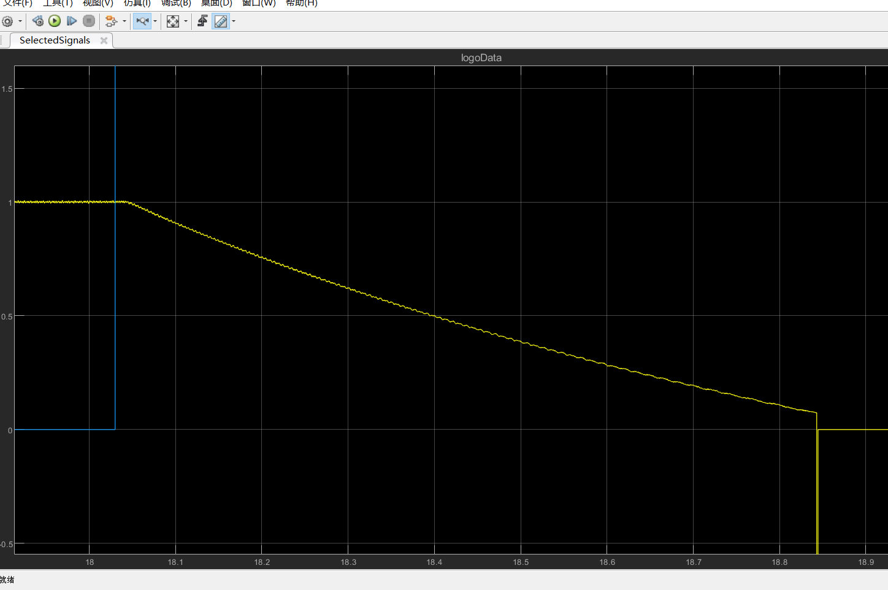

电流Id, Iq变化曲线为：(蓝色Iq，黄色Id)。

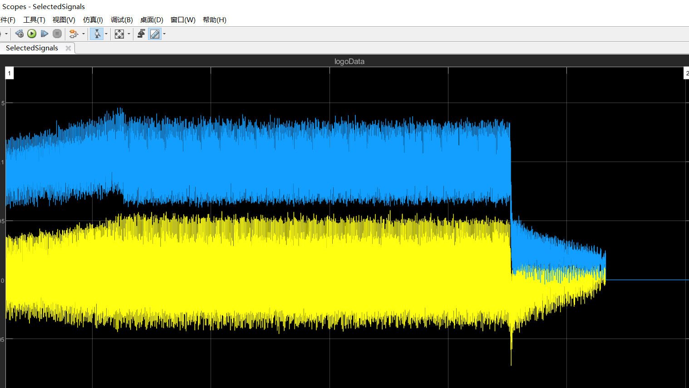