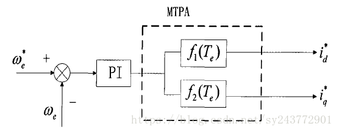
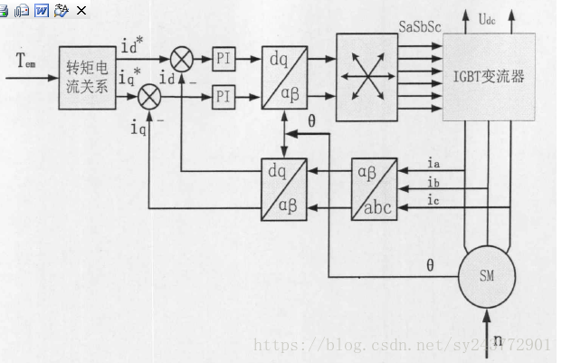
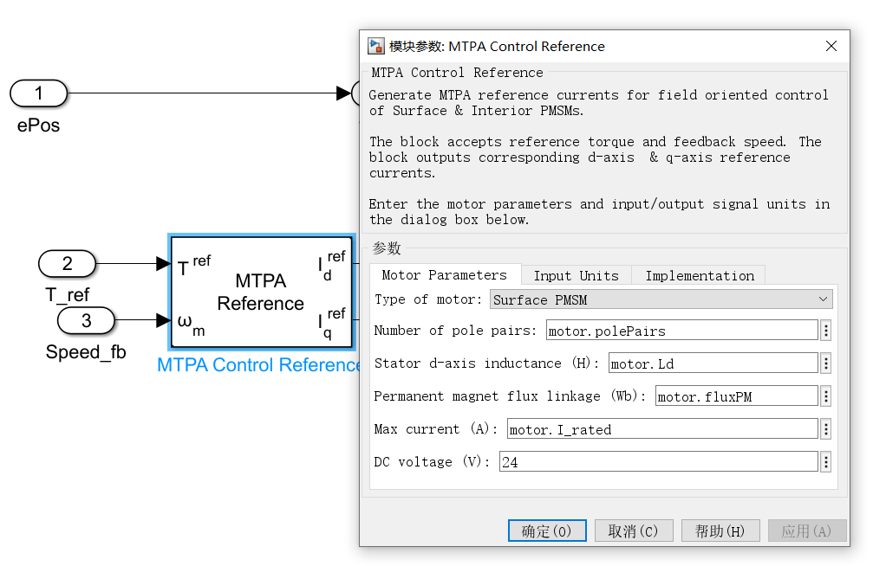
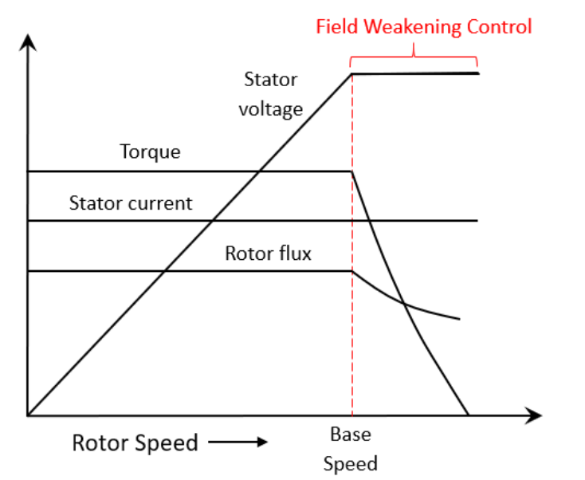
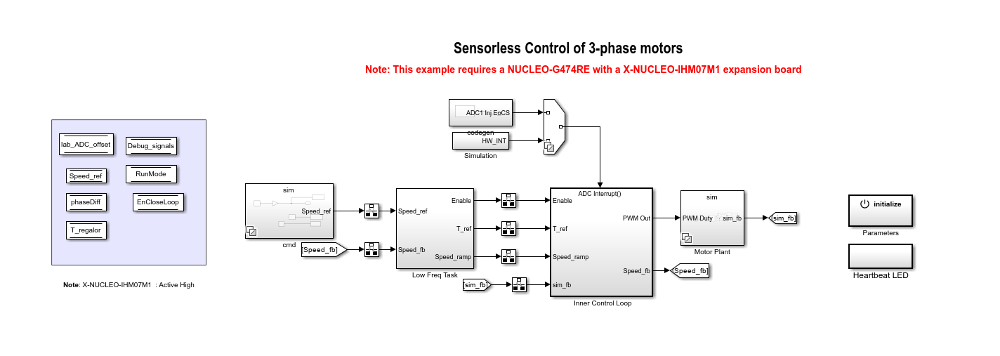
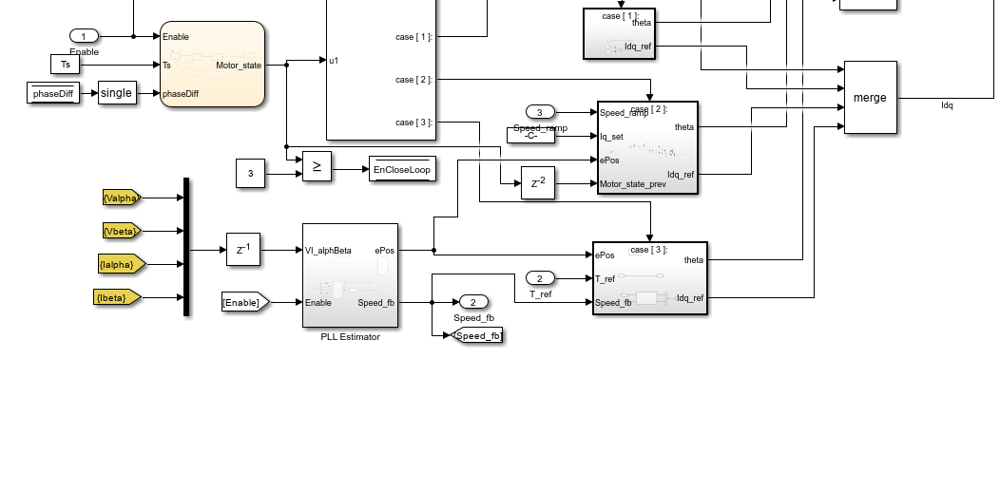
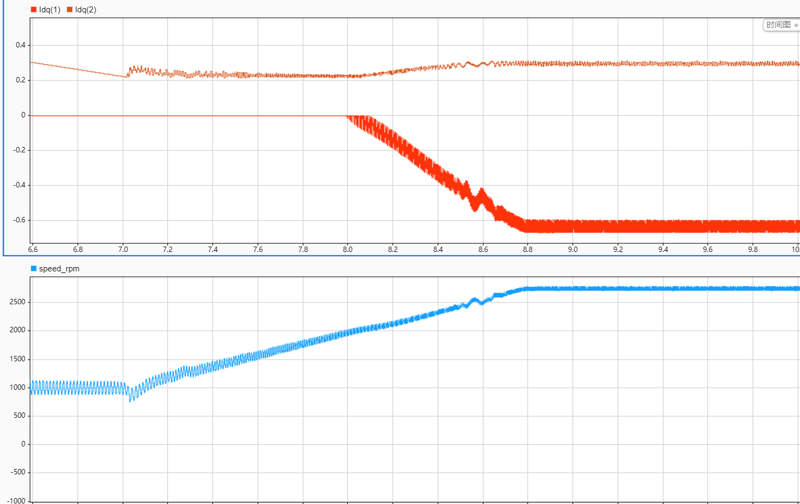
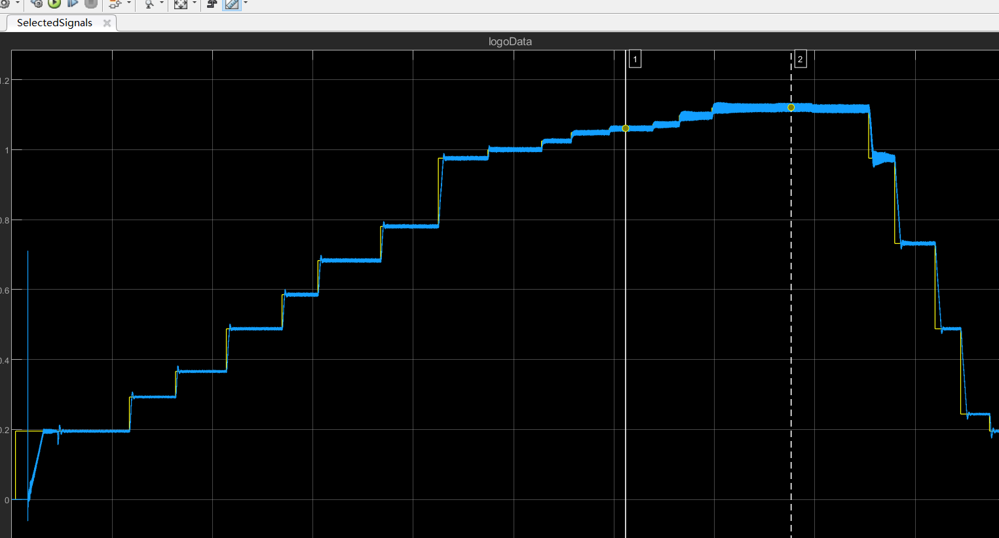
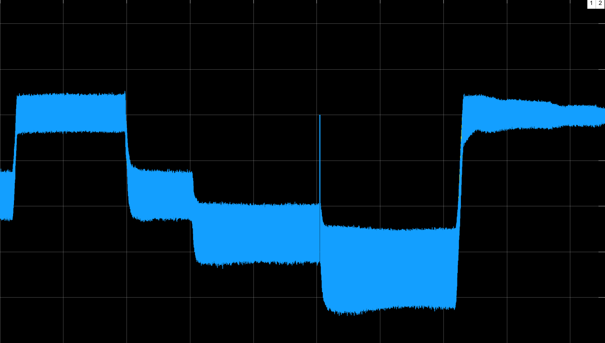

# Sensorless FOC MTPA

## 一 、pmsm MTPA控制原理

​       **1.1 MTPA控制方式与id=0控制方式的区别**

当电机采用id=0的控制策略，但是这种控制方法忽略和磁阻转矩的作用
$$
T_e = \frac{3}{2}.n_p[\psi_f.i_q +(Ld-Lq).i_d.i_q]\\
$$
这个从转矩方程最容易看出来，转矩分为永磁转矩Tr和磁阻转矩Tm，而id=0只剩下Tr。这会导致电流的利用率不高，系统的效率降低。所以id=0的控制比较适用于隐极式电机（Ld=Lq），而对于凸极式电机并不最优，所以需要重新考虑控制策略。

**1.2 推导过程**
为了找到电流和转矩的最佳匹配，使电机能最小的电流产生最大的转矩，这就是数学上的事情了。
列下以下公式，转矩电流之间的关系式
$$
T_e = \frac{3}{2}.n_p [\psi_f.i_q +(Ld-Lq).i_d.i_q]\\
i_s = \sqrt{ i_d^2 + i_q^2}
$$
为了找到极值关系，利用数学中的[拉格朗日](https://so.csdn.net/so/search?q=拉格朗日&spm=1001.2101.3001.7020)定理，引入辅助函数。
$$
H =\sqrt{ i_d^2 + i_q^2}+\lambda \{T_e -\frac{3}{2}.n_p [\psi_f.i_q +(Ld-Lq).i_d.i_q] \}\\
$$
接着开始拉格朗日求极值的过程，
$$
\begin{equation}
    \begin{cases}
    \frac{\partial H}{\partial i_d} =\frac{i_d}{\sqrt{ i_d^2 + i_q^2}}+\frac{3}{2}.n_p(L_q-L_d)i_q , \\
    \frac{\partial H}{\partial i_q} =\frac{i_q}{\sqrt{ i_d^2 + i_q^2}}-\frac{3}{2}.n_p(L_d-L_q)i_d, \\
    \frac{\partial H}{\partial \lambda} = Te - \frac{3}{2}.n_p [\psi_f.i_q +(Ld-Lq).i_d.i_q], 
    \end{cases}
\end{equation}
$$

对上式进行求解，得到了直轴电流id和交轴电流iq的关系，
$$
id = \frac{-\psi_f + \sqrt{\psi_f^2 +8(L_d-L_q)^2i_s^2}}{4(L_d-L_q)}
$$
iq 的计算公式为：
$$
i_q = \frac{(\frac{8T_e\psi_f}{3n_p})+\sqrt{(\frac{8T_e\psi_f}{3n_p})^2-4[\psi_f^2-4(L_d-L_q)^2].[(\frac{4T_e}{3n_p})^2-\psi_f^2]}}{2[\psi_f^2 - 4(L_d-L_q)^2]}
$$
以上公式就是用转速环的输出来计算，来算出给定转矩所对应最低的id和iq，反映到电机上就是定子电流。

**1.3 控制框图**

从转速环输出部分框图

整体控制框图：

## 二 、模型搭建与仿真

### 2.1 MTPA的模型

​        MTPA的id, iq计算，使用了模块mtpa control reference，其利用motor的fluxPM、Ld、polePairs，计算表贴式pmsm的mtpa的id\* 、iq\* ，这里直接使用estimate parameters 辨识的Ke计算fluxPM。

​           当使用 FOC 算法运行具有额定磁通量的电机时，最大速度受定子电压、额定电流和反电动势的限制。此速度称为基速。超过此速度，机器的运行会变得复杂，因为反电动势大于电源电压。但是，如果将 d 轴定子电流 (Id) 设置为负值，转子磁链会减小，从而使电机能够以高于基速的速度运行。此操作称为电机的弱磁控制。

当电机的运行速度超过额定转速时，需要通过id\* <0 ,使得磁通减弱，此时，电机进入弱磁运行状态。

### 2.2 整体的模型框架

​         模型整体沿用无感FOC框架，在速度环计算转矩T_ref ，在电流环，使用MTPA Control Reference根据T_ref、w计算生成id\* 、iq\* 。

MTPA计算嵌入闭环的电流环中

### 2.3 仿真结果

​        这里展示了速度变化曲线，和id\* 、iq\* 变化曲线，当speed_rpm小于2000（额定转速）时，id\* =0 , 当速度继续增加时，id\* <0，转速增加到极限值。

## 四 实验结果

  4.1 本实验使用的是表贴式bldc, 也就是Surface PMSM模型。

4.2 速度响应曲线：

弱磁控制下的速度极限可以达到额定钻速的112%。

当转速小于额定钻速时，id\* = 0； 当转速大于额定转速时，id\* <0 。

